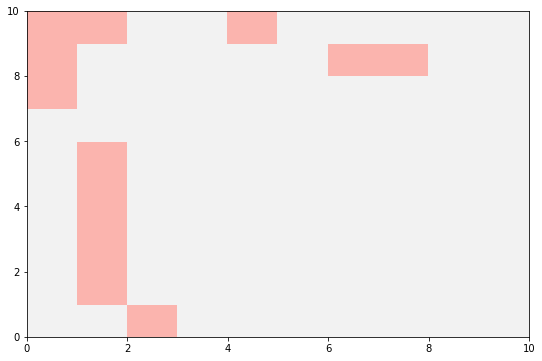
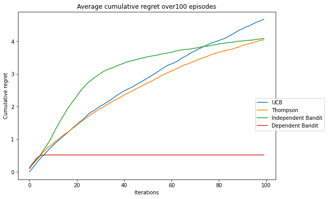

# About
Implementation of the meta RL algorithm proposed by [Prefrontal cortex as a meta-reinforcement learning system](https://www.nature.com/articles/s41593-018-0147-8).

## Experiment setup
We use one-layer LSTM trained with A2C and test it in both independent and dependent bandit problems. All the hypermeters are same as 
suggested in [Learn to reinforcement learn](https://arxiv.org/abs/1611.05763)

## Result
The action sequence generate by the trained LSTM.

Model's performance compared to several standard algorithms.

